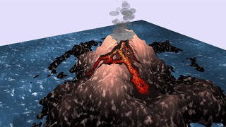

# Volcano

Volcanic eruptions are among the most awe-inspiring and powerful natural phenomena on Earth. This project aims to faithfully reproduce these phenomena through advanced simulation techniques. Our objective is to create realistic volcanic scenes and develop a flexible framework that facilitates the easy creation of diverse terrains and the design of various types of eruptions. To achieve this adaptability, the project embraces a procedural approach for both terrain generation and visual effects. We aim to provide users with an intuitive and interactive experience, allowing them to explore and manipulate volcanic eruptions.
