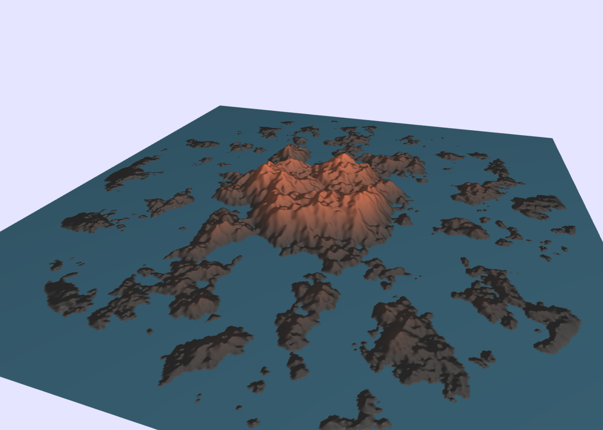
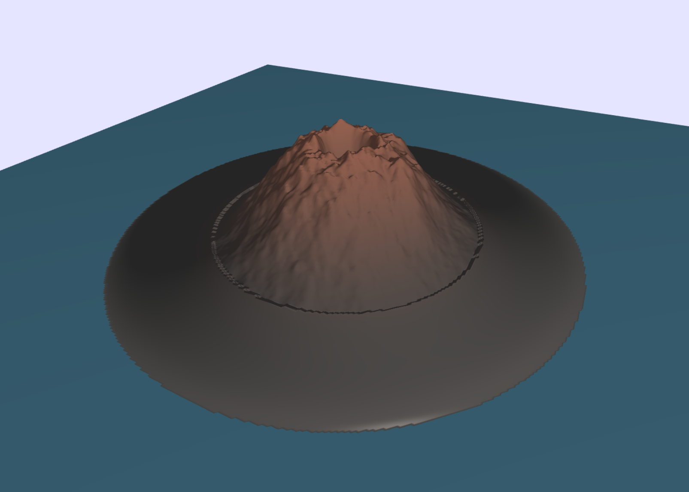
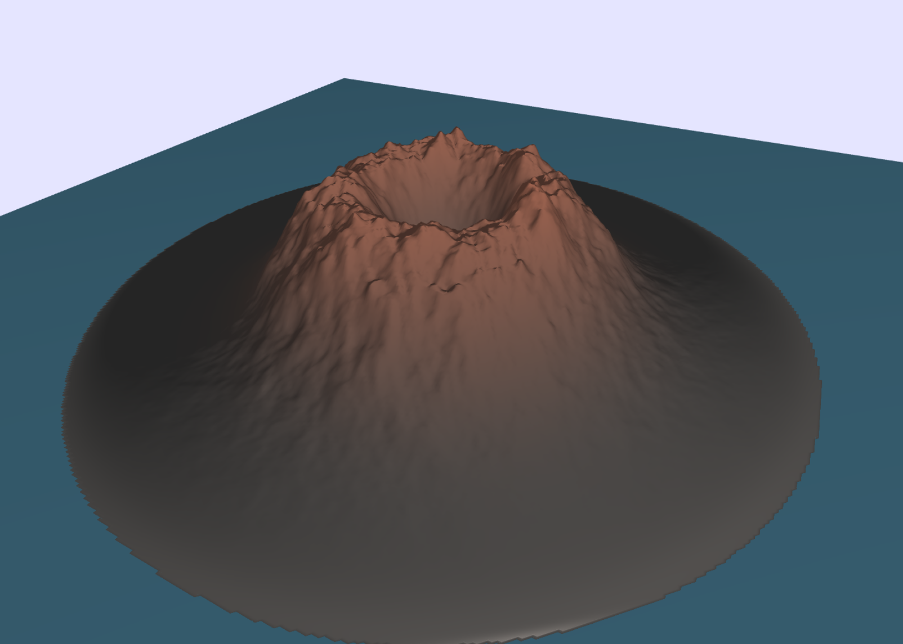
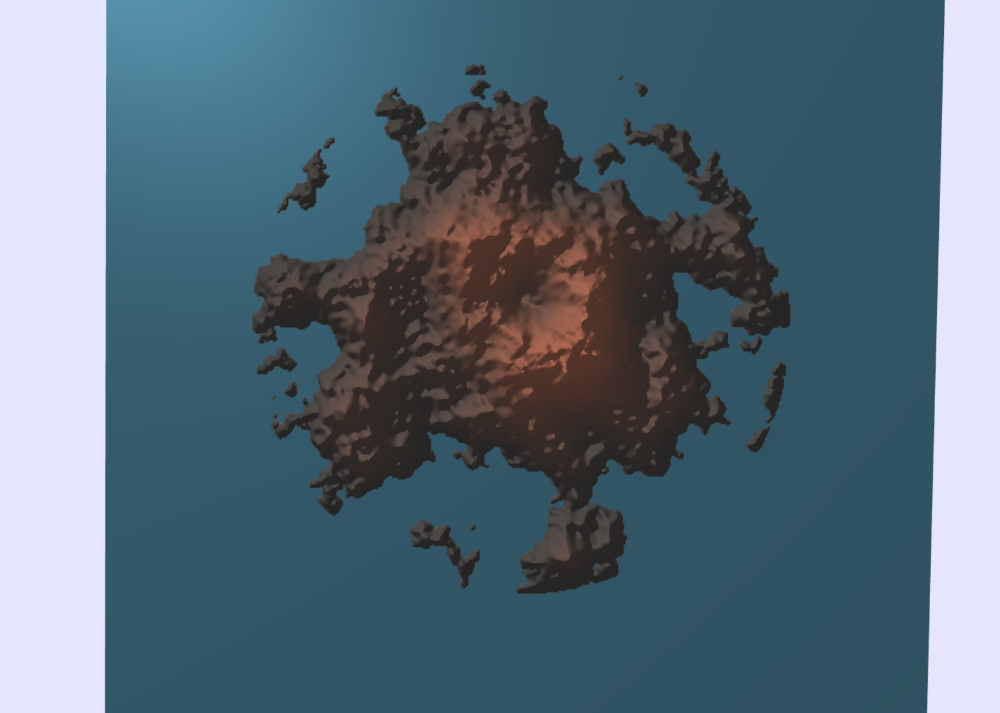
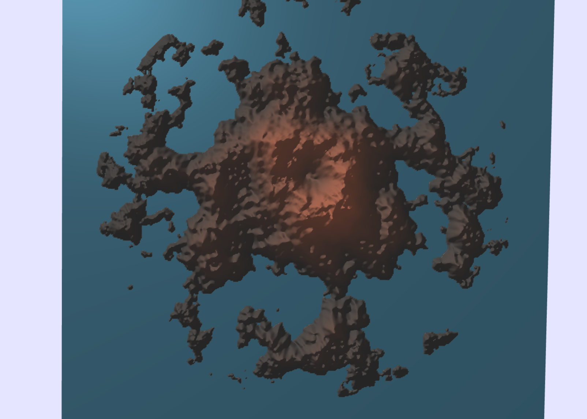
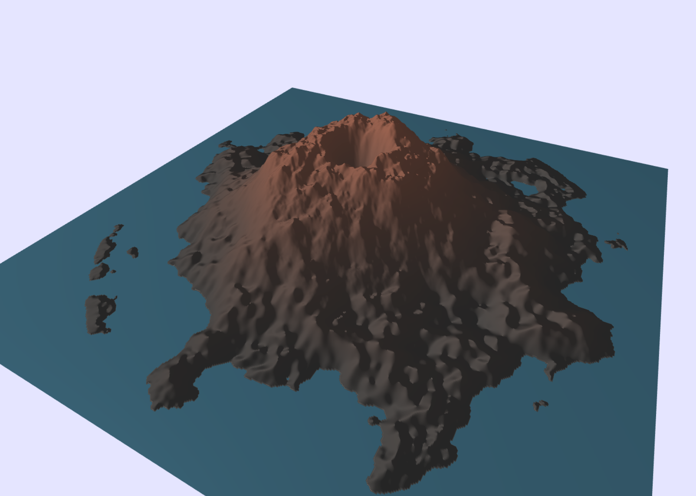
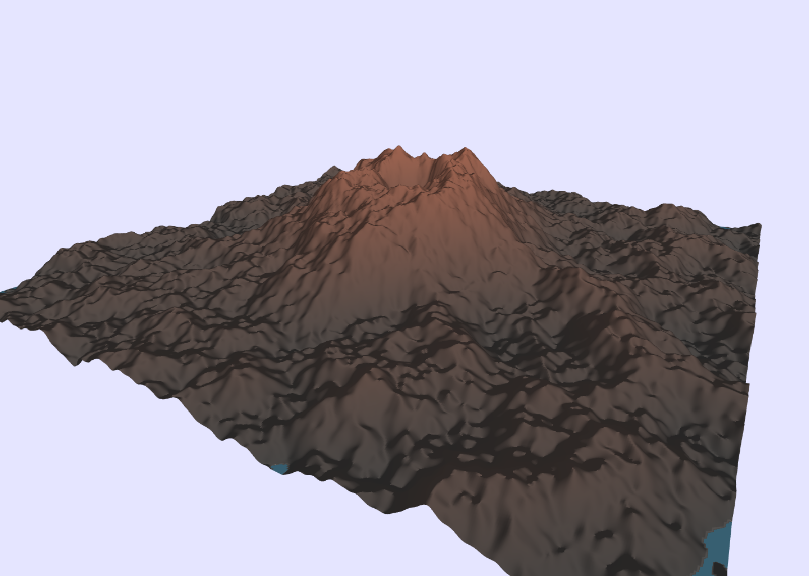
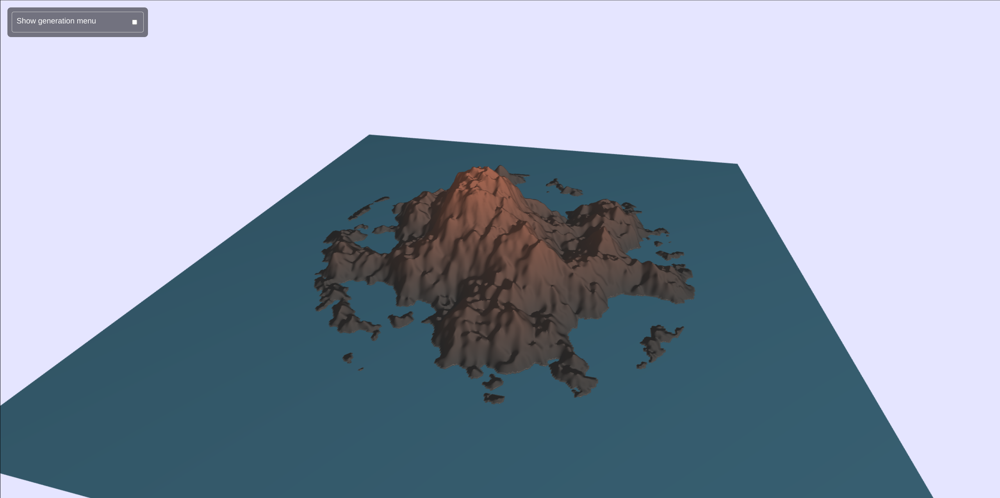

# Volcano

{width="300px"}

## Abstract

Volcanic eruptions are among the most awe-inspiring and powerful natural phenomena on Earth. This project aims to faithfully reproduce these phenomena through advanced simulation techniques. Our objective is to create realistic volcanic scenes and develop a flexible framework that facilitates the easy creation of diverse terrains and the design of various types of eruptions. To achieve this adaptability, the project embraces a procedural approach for both terrain generation and visual effects. We aim to provide users with an intuitive and interactive experience, allowing them to explore and manipulate volcanic eruptions.

## Overview

In this project, we tackle the challenge of rendering realistic volcanic eruptions through physically based simulations. Our framework is designed to be flexible, allowing for the creation of various types of eruptions with ease.

To achieve this goal, we begin by implementing a procedurally generated heightmap terrain system with parameters that can be adjusted through an intuitive UI menu. This procedural approach is chosen for its efficiency in rapidly creating diverse terrains. The procedural generation focuses on creating a volcanic island in the middle of the sea.

The next step is to add textures to achieve a more realistic render of the terrain. We once again choose a procedural approach for its flexibility. Specifically, we have three kinds of procedurally generated textures composing the terrain: the water around the island, the base terrain of the island, and the top of the volcano.

To enhance the realism of the water, we implement normal mapping on the water texture, giving the sensation of volumetric waves. Similarly, to emphasize the "rocky" aspect of the volcano, we add normal mapping to the volcanic terrain. 

Then, to represent the eruption, we chose to take a particle-based approach following the physical properties of lava flows. Thus, we implemented a fluid simulation with added constraints on temperature and viscosity to achieve a realistic lava flow. In particular, the simulation is heavily based on the process described in [Animating Lava Flows](http://www-evasion.imag.fr/Publications/1999/SACNG99/gi99.pdf). We once again adopt a flexible approach that allows easy modification of the simulation parameters, enabling users to experiment with various eruption scenarios.

To add to the immersion of the scene, we chose to include a key component of eruptions: smoke. To achieve this, we implemented a particle system that emits "smoke" particles above the crater of the volcano.

Finally, to enhance realism, we added a temperature-based rendering of the lava particles. While the particle meshes remain independent of each other, this approach contributes to the overall realistic appearance of the lava.

With all these effects implemented, the user is now able to generate various kinds of eruption scenarios based on realistic simulations of flowing lava, enhanced with immersive effects to contribute to the overall experience.

## Feature validation

### Procedural Volcano Terrain Generation

The volcanic island heightmap is composed of two procedurally generated components: the island and the volcano.

#### Island

##### Implementation

The base of the island is created from a conic shape of radius $r$ with an inner flat area at a determined height $h$. Beyond the flat area, the height is linearly interpolated from the height $h$ at the edge of the flat part to $0$ at the distance $r$.

This gives the following foundation for the island:

{width="400px"}

To create an interesting relief, we add a combination of Fractional Brownian Motion (FBM) noises of various frequencies. A frequency factor is made adjustable to allow the user to create terrains with varying degrees of relief.

Following this implementation, we get the following result:

{width="400px"}

The current result starts to resemble an island terrain but still contains a major flaw on the sides with visible transitions that reveal the circular shape of the island.

To solve this issue, we introduce a new parameter, denoted by the transition factor $trans$. This factor determines the distance over which the smooth transition is performed after the island radius. In this area, higher frequency FBM noise is added to the original noise, with their amplitudes gradually decreasing until the distance $r \cdot trans$, where it becomes zero.

The addition of higher frequency noise creates small "rocks" on the edge of the island, giving it a more realistic look and breaking the circular shape. After these adjustments, we achieve the following smooth transition from the island to the water:

{width="400px"}

To fully embrace the flexibility of our model, we make the noise offsets and the island center position adjustable. This allows users to create different-looking islands with the same properties and to move them around the terrain.

##### Validation

This flexible implementation allows for the creation of various kinds of island terrains. Here are a few possibilities offered by this approach:

With a high flat proportion and a low transition factor, we can create compact islands with a harder transition to the ocean:

{width="400px"}

Conversely, setting a small radius with a high transition factor allows for the creation of an island archipelago with a main island in the center and smaller islands spreading around it:

{width="400px"}

Finally, we can adjust the noise amplitude to create a spikier-looking island:

{width="400px"}

#### Volcano

The second step to creating the volcanic island is the volcano itself. We follow a similar approach to the island generation by defining a base structure and adding noise on top of it.

##### Implementation

The first step is to create the global shape of the volcano. We define a volcano using four parameters: the volcano height and radius $h_v, r_v$, and the crater height and radius $h_c, r_c$. For similar reasons to the island generation, we also include a transition factor parameter, denoted $trans$.

We then use two functions to determine the height based on the distance to the volcano center $x$:

- If $x < r_c$, we use a smoothstep interpolation between $h_c$ at $0$ and $h_v$ at $r_c$.
- If $x > r_c$, we use a smoothstep interpolation between $h_v$ at $r_c$ and $0$ at $r_v \cdot trans$.

This creates the following basic shape of a volcano:

{width="400px"}

Next, we add a combination of FBM and turbulence noise within the volcano radius. The result is:

{width="400px"}

Then, we gradually remove the noise over the distance $r_v$ to $r_v \cdot trans$, allowing for a smooth transition. The result is shown below:

{width="400px"}

We also made the noise offsets and center position adjustable to enable the creation of diverse volcanoes. Here is an example with an offset center:

{width="400px"}

##### Validation

Using this framework, we can create various kinds of volcanoes. Here are a few possibilities:

We can create a "small" volcano with a large crater, resulting in steeper sides:

{width="400px"}

We can also generate larger volcanoes:

{width="400px"}

Or we can adjust the noise proportion to create a spikier-looking volcano:

{width="400px"}

#### Combined

##### Implementation 

We then simply combine both heightmaps by adding them.

##### Validation

These implementations of the island and volcano heightmaps allow for the creation of various types of volcanic islands. Here are a few variations:

Here is a normal, pretty small volcanic island:

{width="400px"}

And here are some top views where we vary the island transition parameter to highlight its influence:

{width="400px"}

{width="400px"}

We can create large volcanoes:

{width="400px"}

We can reduce the terrain size to get a close-up view of a volcano:

{width="400px"}

Setting a large island radius, we can create a terrain with no water:

{width="400px"}

Using the same parameters with various noise offsets, we can generate diverse volcanic islands:

{width="400px"}

{width="400px"}

{width="400px"}

#### Menu

To improve the user experience when designing a volcanic island, we have incorporated a menu that allows users to adjust all the generation parameters easily. There are a total of 17 different generation parameters that can be tweaked.

The menu can be closed or opened to avoid wasting view space:

{width="400px"}

{width="400px"}

Fully opened, the menu consists of the following sections to adjust the parameters:

{width="200px"}

{width="200px"}

{width="200px"}

{width="200px"}

In particular, one can set various kinds of resolution depending on the performance/quality desired:

{width="400px"}

### Lava Flow Fluid Simulation

This feature aims to provide a convincing flow of lava. To achieve this goal, we'll perform a particle-based simulation with additional constraints. Our work is highly inspired by the implementation proposed in [Animating Lava Flows](http://www-evasion.imag.fr/Publications/1999/SACNG99/gi99.pdf).

#### Global Concepts

Firstly, each particle will have a radius of $r_p$ and an initial density $\rho_0 = 2500 \; \text{kg/m}^3$. We then have a kernel that describes the particle mass distribution in space. We use the kernel function proposed by [Smoother Particles: A new paradigm for highly deformable bodies](http://www.geometry.caltech.edu/pubs/DC_EW96.pdf):

$$
W_h(\textbf{r}) = \dfrac{15}{\pi(4h)^3} \begin{cases}
    (2 - \frac{r}{h})^3 \quad \text{if } 0 \leq r \leq 2h \\
    0 \quad \text{if } r > 2h
\end{cases}
$$

Note that the particle mass $m_p$ and the kernel parameter $h$ are constrained by the particle radius.

Then, we say that two particles are neighbors if they are at a distance lower than $2h$ from one another.

A high-level view of the simulation is as follows: For each timestep, we first compute all the forces that apply to each particle. Then, we integrate the ODE using the integration method of our choice. Finally, we update the particle characteristics for the next iteration.

#### Implementation

TODO

#### Validation

TODO

### Smoke Particles

#### Implementation

The smoke effect is a combination of multiple small particles. Every particle is a partially transparent ellipse. It has a position in the world and always faces the camera. Every particle rises up for a random amount of time, becoming dimmer and then disappearing. 

#### Validation

TODO

## Discussion

TODO

## Contributions

<table>
	<caption>Worked hours</caption>
	<thead>
		<tr>
			<th>Name</th>
			<th>Week 1</th>
			<th>Week 2</th>
			<th>Week 3</th>
			<th>Week 4</th>
			<th>Week 5</th>
			<th>Week 6</th>
			<th>Total</th>
		</tr>
	</thead>
	<tbody>
		<tr>
			<td>Name 1</td>
			<td>TODO</td>
			<td>TODO</td>
			<td>TODO</td>
			<td>TODO</td>
			<td>TODO</td>
			<td>TODO</td>
			<td>TODO</td>
		</tr>
		<tr>
			<td>Name 2</td>
			<td>TODO</td>
			<td>TODO</td>
			<td>TODO</td>
			<td>TODO</td>
			<td>TODO</td>
			<td>TODO</td>
			<td>TODO</td>
		</tr>
		<tr>
			<td>Name 3</td>
			<td>TODO</td>
			<td>TODO</td>
			<td>TODO</td>
			<td>TODO</td>
			<td>TODO</td>
			<td>TODO</td>
			<td>TODO</td>
		</tr>
	</tbody>
</table>

<table>
	<caption>Individual contributions</caption>
	<thead>
		<tr>
			<th>Name</th>
			<th>Contribution</th>
		</tr>
	</thead>
	<tbody>
		<tr>
			<td>Name 1</td>
			<td>1/3</td>
		</tr>
		<tr>
			<td>Name 2</td>
			<td>1/3</td>
		</tr>
		<tr>
			<td>Name 3</td>
			<td>1/3</td>
		</tr>
	</tbody>
</table>

#### Comments

TODO

## References

TODO