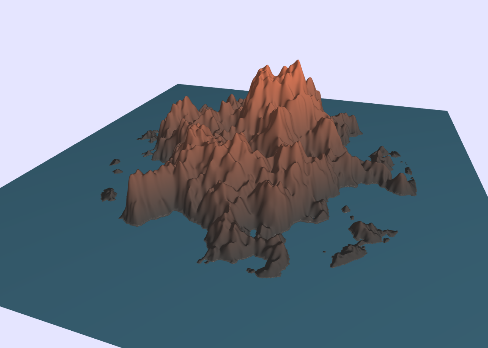
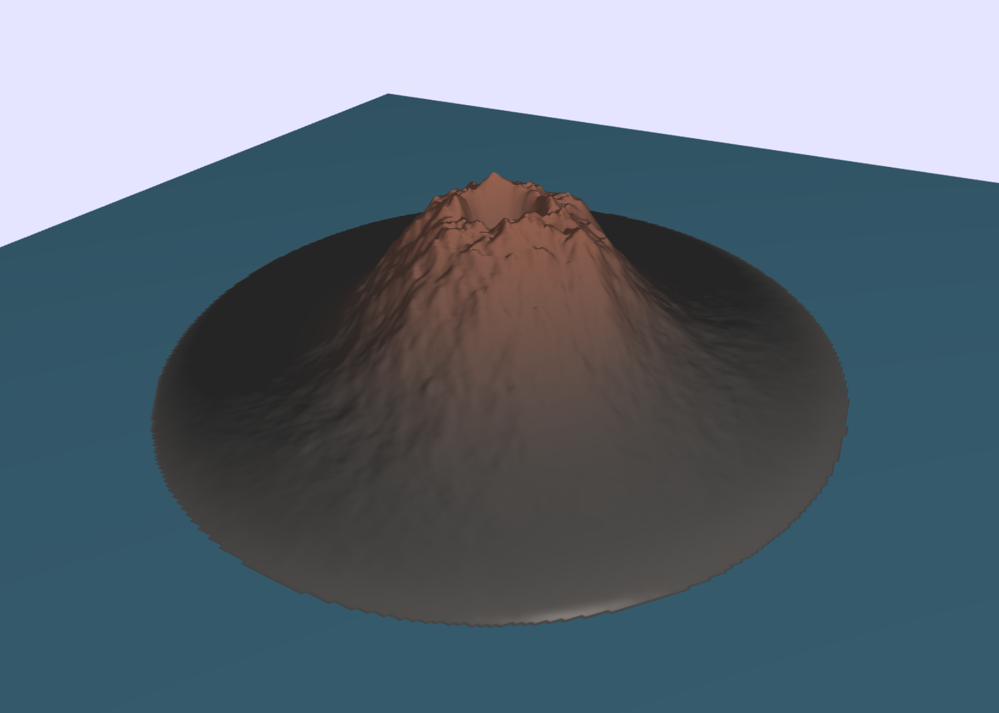
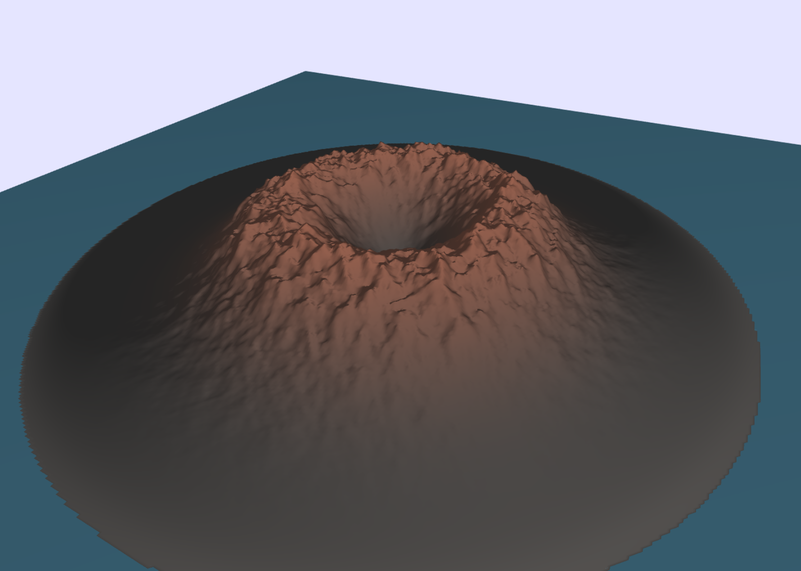
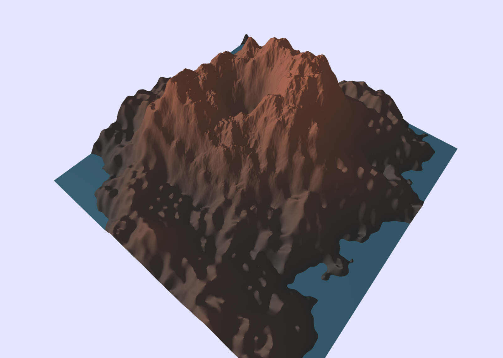
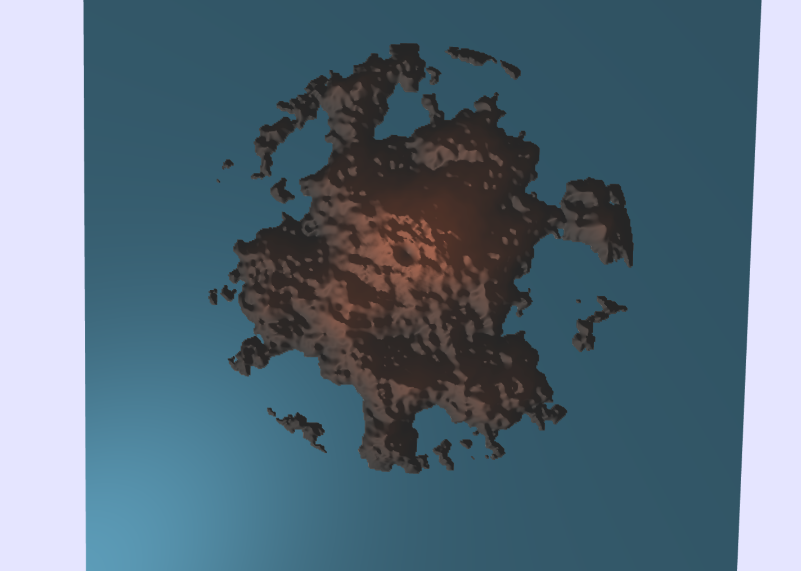
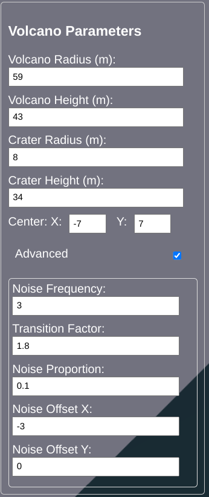
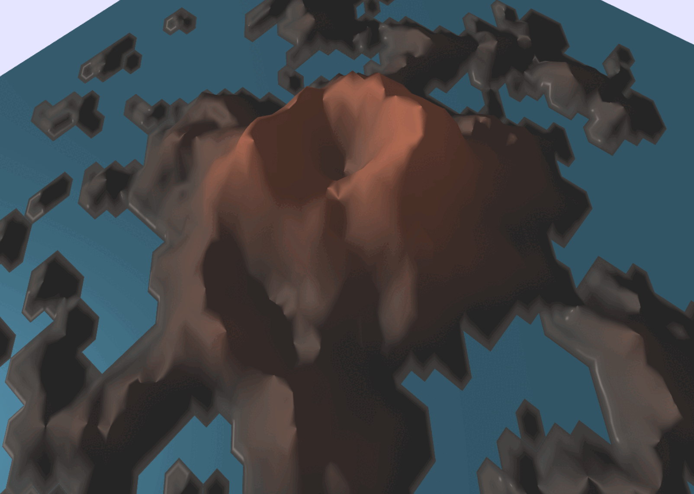

# Volcano

{width="600px"}


## Abstract

Volcanic eruptions are among the most awe-inspiring and powerful natural phenomena on Earth. This project aims to faithfully reproduce these phenomena through advanced simulation techniques. Our objective is to create realistic volcanic scenes and develop a flexible framework that facilitates the easy creation of diverse terrains and the design of various types of eruptions. To achieve this adaptability, the project embraces a procedural approach for both terrain generation and visual effects. We aim to provide users with an intuitive and interactive experience, allowing them to explore and manipulate volcanic eruptions.


## Overview

In this project, we tackle the challenge of rendering realistic volcanic eruptions through physically based simulations. Our framework is designed to be flexible, allowing for the creation of various types of eruptions with ease.

To achieve this goal, we begin by implementing a procedurally generated heightmap terrain system with parameters that can be adjusted through an intuitive UI menu. This procedural approach is chosen for its efficiency in rapidly creating diverse terrains. The procedural generation focuses on creating a volcanic island in the middle of the sea.

The next step is to add textures to achieve a more realistic render of the terrain. We once again choose a procedural approach for its flexibility. Specifically, we have three kinds of procedurally generated textures composing the terrain: the water around the island, the base terrain of the island, and the top of the volcano.

To enhance the realism of the water, we implement normal mapping on the water texture, giving the sensation of volumetric waves. Similarly, to emphasize the "rocky" aspect of the volcano, we add normal mapping to the volcanic terrain. 

Then, to represent the eruption, we chose to take a particle-based approach following the physical properties of lava flows. Thus, we implemented a fluid simulation with added constraints on temperature and viscosity to achieve a realistic lava flow. In particular, the simulation is heavily based on the process described in [Animating Lava Flows](http://www-evasion.imag.fr/Publications/1999/SACNG99/gi99.pdf). We once again adopt a flexible approach that allows easy modification of the simulation parameters, enabling users to experiment with various eruption scenarios.

To add to the immersion of the scene, we chose to include a key component of eruptions: smoke. To achieve this, we implemented a particle system that emits "smoke" particles above the crater of the volcano.

Finally, to enhance realism, we added a temperature-based rendering of the lava particles. While the particle meshes remain independent of each other, this approach contributes to the overall realistic appearance of the lava.

With all these effects implemented, the user is now able to generate various kinds of eruption scenarios based on realistic simulations of flowing lava, enhanced with immersive effects to contribute to the overall experience.


## Feature validation


### Procedural Volcano Terrain Generation (5 points)

The volcanic island heightmap is composed of two procedurally generated components: the island and the volcano.

#### Island

##### Implementation

The base of the island is created from a conic shape of radius $r$ with an inner flat area at a determined height $h$. Beyond the flat area, the height is linearly interpolated from the height $h$ at the edge of the flat part to $0$ at the distance $r$.

This gives the following foundation for the island:

{width="400px"}

To create an interesting relief, we add a combination of Fractional Brownian Motion (FBM) noises of various frequencies. A frequency factor is made adjustable to allow the user to create terrains with varying degrees of relief.

Following this implementation, we get the following result:

{width="400px"}

The current result starts to resemble an island terrain but still contains a major flaw on the sides with visible transitions that reveal the circular shape of the island.

To solve this issue, we introduce a new parameter, denoted by the transition factor $trans$. This factor determines the distance over which the smooth transition is performed after the island radius. In this area, higher frequency FBM noise is added to the original noise, with their amplitudes gradually decreasing until the distance $r \cdot trans$, where it becomes zero.

The addition of higher frequency noise creates small "rocks" on the edge of the island, giving it a more realistic look and breaking the circular shape. After these adjustments, we achieve the following smooth transition from the island to the water:

{width="400px"}

To fully embrace the flexibility of our model, we make the noise offsets and the island center position adjustable. This allows users to create different-looking islands with the same properties and to move them around the terrain.

##### Validation

This flexible implementation allows for the creation of various kinds of island terrains. Here are a few possibilities offered by this approach:

With a high flat proportion and a low transition factor, we can create compact islands with a harder transition to the ocean:

{width="400px"}

Conversely, setting a small radius with a high transition factor allows for the creation of an island archipelago with a main island in the center and smaller islands spreading around it:

{width="400px"}

Finally, we can adjust the noise amplitude to create a spikier-looking island:

{width="400px"}


#### Volcano

The second step to creating the volcanic island is the volcano itself. We follow a similar approach to the island generation by defining a base structure and adding noise on top of it.

##### Implementation

The first step is to create the global shape of the volcano. We define a volcano using four parameters: the volcano height and radius $h_v, r_v$, and the crater height and radius $h_c, r_c$. For similar reasons to the island generation, we also include a transition factor parameter, denoted $trans$.

We then use two functions to determine the height based on the distance to the volcano center $x$:

- If $x < r_c$, we use a smoothstep interpolation between $h_c$ at $0$ and $h_v$ at $r_c$.
- If $x > r_c$, we use a smoothstep interpolation between $h_v$ at $r_c$ and $0$ at $r_v \cdot trans$.

This creates the following basic shape of a volcano:

{width="400px"}

Next, we add a combination of FBM and turbulence noise within the volcano radius. The result is:

{width="400px"}

Then, we gradually remove the noise over the distance $r_v$ to $r_v \cdot trans$, allowing for a smooth transition. The result is shown below:

{width="400px"}

We also made the noise offsets and center position adjustable to enable the creation of diverse volcanoes. Here is an example with an offset center:

{width="400px"}

##### Validation

Using this framework, we can create various kinds of volcanoes. Here are a few possibilities:

We can create a "small" volcano with a large crater, resulting in steeper sides:

{width="400px"}

We can also generate larger volcanoes:

{width="400px"}

Or we can adjust the noise proportion to create a spikier-looking volcano:

{width="400px"}


#### Combined

##### Implementation 

We then simply combine both heightmaps by adding them.

##### Validation

These implementations of the island and volcano heightmaps allow for the creation of various types of volcanic islands. Here are a few variations:

Here is a normal, pretty small volcanic island:

{width="400px"}

And here are some top views where we vary the island transition parameter to highlight its influence:

{width="400px"}

{width="400px"}

We can create large volcanoes:

{width="400px"}

We can reduce the terrain size to get a close-up view of a volcano:

{width="400px"}

Setting a large island radius, we can create a terrain with no water:

{width="400px"}

Using the same parameters with various noise offsets, we can generate diverse volcanic islands:

{width="400px"}

{width="400px"}

{width="400px"}


#### Menu

To improve the user experience when designing a volcanic island, we have incorporated a menu that allows users to adjust all the generation parameters easily. There are a total of 17 different generation parameters that can be tweaked.

The menu can be closed or opened to avoid wasting view space:

{width="400px"}

{width="400px"}

Fully opened, the menu consists of the following sections to adjust the parameters:

{width="200px"}

{width="200px"}

{width="200px"}

{width="200px"}

In particular, one can set various kinds of resolution depending on the performance/quality desired:

{width="400px"}


### Lava Flow Fluid Simulation (20 points)

This feature aims to provide a convincing flow of lava. To achieve this goal, we'll perform a particle-based simulation with additional constraints. Our work is highly inspired by the implementation proposed in [Animating Lava Flows](http://www-evasion.imag.fr/Publications/1999/SACNG99/gi99.pdf).

#### Global Concepts

Firstly, each particle will have a radius of $r_p$ and an initial density $\rho_0 = 2500 \; \text{kg/m}^3$. We then have a kernel that describes the particle mass distribution in space. We use the kernel function proposed by [Smoother Particles: A new paradigm for highly deformable bodies](http://www.geometry.caltech.edu/pubs/DC_EW96.pdf):

$$
W_h(\textbf{r}) = \dfrac{15}{\pi(4h)^3} \begin{cases}
    (2 - \frac{r}{h})^3 \quad \text{if } 0 \leq r \leq 2h \\
    0 \quad \text{if } r > 2h
\end{cases}
$$

Note that the particle mass $m_p$ and the kernel parameter $h$ are constrained by the particle radius.

Then, we say that two particles are neighbors if they are at a distance lower than $2h$ from one another.

A high-level view of the simulation is as follows: For each timestep, we first compute all the forces that apply to each particle. Then, we integrate the ODE using the integration method of our choice. Finally, we update the particle characteristics for the next iteration.


#### Pressure Force

##### Implementation

The pressure of a particle is determined by the formula:

$$
P = k (\rho - \rho_0)
$$

where $k$ is the incompressibility factor and $\rho$ is the current density of the particle computed as follows for particle $i$: $\rho_i = \sum_{j} (W_h^{ij} m_j)$. More details can be found in [Animating Lava Flows](http://www-evasion.imag.fr/Publications/1999/SACNG99/gi99.pdf).

From the pressure, we can compute the resulting force exerted on the particle. Note that because the kernel $W_h^{ij}$ is $0$ if the particles $i$ and $j$ are at a distance greater than $2h$ (i.e., not neighbors), the summation can be performed only on the particle's neighbors.

{width="300px"}

##### Validation

We can test this feature by only applying the pressure forces on the particles. Because we spawn the particles on a 2-dimensional plane and no other forces are taken into account, the particles will stay in this plane.

The following video presents the action of pressure force:

{width="300px"}


#### Viscosity Force

##### Implementation

We compute the force from viscosity applied to a particle using the formula:

{width="300px"}

where $v_{ij}$ is the relative speed difference between particles $i$ and $j$. This formula implies that a particle will be "attracted" by the flowing particles around it, which is the behavior we are looking for to simulate viscosity. Also, $\alpha_v$ is a parameter dependent on the particle temperature, but we consider it constant for now. We'll detail it further when considering temperature exchanges.

##### Validation

We can add viscosity forces on top of the previous simulation to get the following result:

{width="300px"}

As we can see, the particles are now moving in *blocks*, which is the expected behavior with viscosity.


#### Gravity

##### Implementation

The next step for our simulation is to add the gravity force.

This force can be easily computed by $\vec{F_g} = (0,0,-mg)$, with $g=9.81 \; \text{m/s}^2$.

##### Validation

We now add the gravity force to the simulation to get the following result:

{width="300px"}

As expected, the particles are now falling, passing through the floor because collisions are not yet implemented.


#### Ground Collision

##### Implementation

To simulate flows, we need to account for collisions with the ground. After experimenting with various methods, we chose a simple implementation of ground collisions.

At each iteration, we check if any particles are below the ground. If so, we force their position to be on the ground. Moreover, to simulate the effect of lava adhering to the ground, we set the particle velocity to 0. This approach allows us to achieve convincing flows with a very simple implementation and ensures that no particles pass through the ground, which could happen with a force-based approach due to instabilities in the simulation. For these reasons, we chose this method.

##### Validation

To test the collision, we can simply emit particles above a plane as shown below:

{width="300px"}

Moreover, we now have the necessary basis to create a first, very basic flow:

{width="300px"}

As we can see, we get a viscous fluid, which is what we are looking for to animate lava.

#### Ground Temperature Transfer

##### Implementation

To implement temperature transfers with the ground, we apply the following temperature variation to all particles that are in ground collision:

{width="300px"}

where $r_i$ is the particle radius, $T_{ext}$ is the temperature of the ground, and $k_{ext}$ is the heat transfer coefficient between the ground and our lava particles. From this formula, we can determine the variation in temperature of particles on the ground at each timestep.

##### Validation

We can test this by letting a flow on the ground. To visualize the temperature, we link it to the particle color, transitioning from hotter to colder as follows:

Yellow -> Red -> Black

We can visualize the temperature transfer below:

{width="300px"}

{width="300px"}

We can see that the particles on the ground have their temperature decrease, which is the expected behavior.

#### Surface Temperature Transfer

##### Implementation

To detect if a particle is at the surface, we check if among its neighbors there is a particle above its center. This simple implementation allows us to efficiently categorize whether a particle is at the surface of the flow.

Then, the same formula as for ground transfers is used:

{width="300px"}

##### Validation

The following video displays temperature transfers involving only surface particles:

{width="300px"}

We can see that the surface particles have their temperature decreasing, which is the expected behavior.

#### Internal Temperature Transfer

##### Implementation

The final step in temperature simulation is to consider the transfer between the particles themselves. To achieve this, we follow the formula proposed in [Animating Lava Flows](http://www-evasion.imag.fr/Publications/1999/SACNG99/gi99.pdf):

{width="150px"}

The temperature Laplacian $\Delta T$ is computed from the gradient using the following formula:

{width="300px"}

##### Validation

To demonstrate internal temperature transfer, we must also account for some form of external transfer. Without it, no heat loss occurs, and the particles remain at the same temperature. Therefore, in the following examples, we consider both ground and internal transfers.

We highlight the internal transfer by comparing scenarios with and without considering it.

{width="300px"}

{width="300px"}

As expected, with internal transfers, the heat loss is propagated to particles that are not in direct contact with the ground. This is the desired behavior, as it more accurately simulates the diffusion of heat within the lava flow.


#### Temperature-Based Viscosity

##### Implementation

To achieve a realistic simulation of lava flow, it is crucial to consider that the viscosity of the flow increases exponentially as the temperature decreases. This relationship is captured by the factor $\alpha_v$, used previously to compute viscosity. The factor is computed as follows:

$$
\alpha_v = b \exp \left( -a \frac{T}{T_{initial}} \right)
$$

where $a$ and $b$ are parameters chosen to match the desired behavior. In our simulation, we use $a = 10^6$ and $b = 1.5$.

##### Validation

To demonstrate the effect of this feature, we present the flow of particles at different temperatures.

{width="300px"}

{width="300px"}

It is evident that the cold lava flow does not expand as much as the hot flow. This behavior aligns with the expectation that the cold flow is more viscous.


#### Integration Method

##### Implementation

After computing all the derivatives of each parameter at a given timestep, it is necessary to integrate the ordinary differential equations (ODEs) to determine the parameters for the next step.

Initially, we employed the Euler Explicit method due to its simplicity. However, despite its ease of implementation, this method lacks stability and only converges for the first order. Consequently, a very small timestep is required to maintain stable simulations, which significantly increases computation time.

To address this issue, we transitioned to the Runge-Kutta order 2 method. Although the implementation of this method is more complex, it offers superior stability for our simulations (at order 2), allowing us to use a larger timestep.

Both methods have been retained in the implementation, enabling users to select the appropriate method based on their needs. For our simulations, we predominantly use the Runge-Kutta 2 method.

##### Validation

To illustrate the advantages provided by the Runge-Kutta 2 method, we conducted two simulations with identical parameters: one using the Euler Explicit method and the other using the Runge-Kutta 2 method.

{width="300px"}

{width="300px"}

The simulation using the Euler Explicit method rapidly becomes unstable and unusable. In contrast, the simulation using the Runge-Kutta 2 method remains stable and produces convincing results. This comparison underscores the importance of the integration method in our simulation.


#### Optimization

##### Implementation

The current implementation yields convincing results, but a significant performance issue remains. At each timestep, we need to determine the neighbors of each particle (particles that are within a distance of $< 2h$).

The straightforward approach is to loop over all particles for each particle to identify its neighbors. While simple, this method results in a quadratic time complexity with respect to the number of particles, making the simulation extremely slow as the number of particles increases.

To overcome this problem, we perform the following optimization:
We divide the simulated terrain into a grid where each cell is $2h$ by $2h$. Each particle is assigned to a cell based on its position. For the neighbor search, we only need to examine the current cell and the 8 surrounding cells. This approach allows for an almost constant time lookup for neighbors. After each timestep, the particles' positions in the grid are updated.

As a result, the neighbor search becomes almost linear in complexity, making simulations with a high number of particles feasible.

##### Validation

To demonstrate the benefits of our optimization, we performed the simulation of the following scene with and without the optimization and recorded the time required to bake the simulation.

{width="300px"}

<table>
  <caption>Optimisation baking times</caption>
  <thead>
    <tr>
      <th>Neighbor search method</th>
      <th>Baking time</th>
    </tr>
  </thead>
  <thead>
    <tr>
      <th>Loop</th>
      <th>5m19s</th>
    </tr>
  </thead>
  <thead>
    <tr>
      <th>Grid</th>
      <th>44.5s</th>
    </tr>
  </thead>
</table>

The simulation using the grid method is more than seven times faster than the simple loop method. This highlights the significant impact of the neighbor search implementation on the simulation's performance.

#### Scheduling Mechanism

##### Implementation

An important aspect of our project is to provide a simple way to create eruptions. This requires a straightforward interface for generating various flows. We chose to expose an interface that allows the user to specify the emission schedule with key points.

The format for each key is as follows:

```json
{ "start_time": "", "duration": "", "particles_per_second": "" }
```

Each key is placed in a list, and the emission follows this schedule.

##### Validation

This approach allows us to simulate eruptions by emitting a large number of particles over a short period. For instance, we use the following schedule:

```json
[
  { "start_time": 0, "duration": 2, "particles_per_second": 3000 },
  { "start_time": 2, "duration": 10, "particles_per_second": 200 },
  { "start_time": 15, "duration": 1, "particles_per_second": 3000 }
]
```

This schedule produces the following simulation:

{width="300px"}

We observe that the simulation creates an eruption-like effect, which aligns with our project goals.

#### Examples

Here, we present an example of integrating the simulation with the previously developed terrain features.

{width="300px"}

{width="300px"}

{width="300px"}

{width="300px"}

To highlight the critical importance of selecting an appropriate timestep, we demonstrate the consequences of setting the timestep too large. Even with the Runge-Kutta 2 method, an improperly chosen timestep can lead to instability in the simulation. The following video illustrates the outcome when the timestep is excessively large:

{width="300px"}

### Semi-physically-based Rendering for Lava Particles (10 points)

In the previous section on lava simulation, the mechanisms of temperature transfer are discussed to model the transition of lava temperature as it flows down the volcano. Modeling the temperature change serves two main purposes. First, it helps determine the viscosity change, allowing the system to automatically adjust the flow behavior. Second, it enables rendering the lava based on its temperature.

#### Implementation

First, we must determine the color of basaltic magma based on its temperature. After some resarch, the following presents a simple scale to determine the color of the magma depending on its temperature ([Lava Colors](https://www.science.smith.edu/~jbrady/petrology/advPet-topics/kinetics/kinetics-figure10.php)).

{width="600px"}


Thus, to implement the rendering, we'll perform a gradient between 3 colors. Using the informations on the lava color above, we set the 3 points in our gradient as below:

- $1200 °C$, Yellow color <span style="background-color: yellow">-----</span>, (`lava_hot_color`)
- $900 °C$, Red color <span style="background-color: red">-----</span>, (`lava_middle_color`)
- $500 °C$, Black color <span style="background-color: black">-----</span>, (`lava_cold_color`)

Concretely, the implementation is done as follows.
The temperature is passed into the shader as a "uniform" variable. First, we have to define the relationship between the color of the particle with corresponding temperature. This is done by defining the color for "hot", "median" and "cold" temperature particles respectively. Then by using the "mix" function, we create the color transition for all ranges of temperature:

```glsl
if(particle_temperature < middle_lava_temp) {
    material_color = mix(lava_cold_color, lava_middle_color, 
	clamp((particle_temperature - cold_lava_temp) 
	/ (middle_lava_temp - cold_lava_temp), 0.0, 1.0)); }
else {
    material_color = mix(lava_middle_color, lava_hot_color, 
	clamp((particle_temperature - middle_lava_temp) 
	/ (hot_lava_temp - middle_lava_temp), 0.0, 1.0)); }
```

#### Validation

The following presents the particle color depending on the temperature that is going from $1200 °C$ to $500 °C$.

{width="300px"}


This color transition is crucial as it forms the foundation for applying procedurally-generated textures later on. The dynamic color changes not only enhance visual realism but also provide valuable insights into the underlying thermal processes, contributing to the overall accuracy and aesthetic quality of the simulation.


### Normal Mapping (10 points) with Procedural Texture Generation for Volcano/Water/Lava Particles (10 points)

Normal mapping is a vital technique that increases the visual complexity of a surface without adding more polygons. It improves how light interacts with a surface, resulting in more realistic shading and lighting effects.

To create the normal map, we use a procedural generation method. This technique employs mathematical functions and algorithms to produce intricate patterns, surfaces, and textures. Our goal is to use this method to enhance the details of volcanoes, water, and lava particles.

#### Implementation (Terrain)

The terrain in our scene consists of two distinct elements: the volcano and the island. To replicate their natural appearance as accurately as possible, we combine multiple textures. At higher altitudes, we aim to create realistic mountain ridges that gradually transition into a rocky texture as the elevation decreases. This approach ensures a more lifelike and visually appealing representation of the terrain, enhancing the overall realism and immersion of the scene.

#### Validation (Terrain)

Since procedually-generated textures are difficult to manipulate and tune in terms of their artistic facade, we referred to SHADERTOY demonstrations as basis to get more feeling on the textures. The resources are listed in the last section of the report. 

The normal map for mountain ridges is realized by leveraging fractal brownian motion on value noise. Then, a fixed direction light source is implemented to generate the texture map for mountain ridges. 

{width="400px"}

In the same manner, the rock on the lower altitude is implemented with fBm on Perlin noise. The overall result is an affine combination of the two textures according to the altitude (z) coordinate.

{width="400px"}

#### Implementation (Water)

In order to create realistic water, we combine three different approaches: normal mapping, texture with highlighted edges (similar idea as in toon shading) and cellular noise. 

#### Validation (Water)

The normal map for the water surface follows a similar generation process as that used for the mountain ridges. However, it employs different octaves of fractal Brownian motion applied to value noise. This resulting normal map is subsequently integrated into the lighting model, serving as foundational detail for the water's appearance.

{width="400px"}

To enhance the realism of the water waves, we aim to incorporate highlights along their rims. To achieve this effect, we adopt a straightforward approach of blending between the colors of the water's dark regions and the bright edges of the waves. Unlike traditional toon shading techniques that rely on threshold values for this purpose, we employ a higher-order polynomial interpolation method. This approach ensures a smoother transition between colors, preventing overly sharp contrasts while still maintaining sufficient visual contrast.

{width="400px"}

The coefficient of the polynomial is calculated as below. This value is used for interpolation for other colors.

```glsl
float find_k(vec2 point, vec2 col){
	float k = (col.y - col.x)/pow(point.y - point.x, 3.);
	return k; }
...

float coef_r = find_k(wa_tex_range, vec2(wa_col_dark.x, wa_col_light.x));
float coef_g = find_k(wa_tex_range, vec2(wa_col_dark.y, wa_col_light.y));
float coef_b = find_k(wa_tex_range, vec2(wa_col_dark.z, wa_col_light.z));

vec3 water_color = vec3(coef_r * pow(water_tex.x - wa_tex_range.x, 3.) 
	+ wa_col_dark.x, coef_g * pow(water_tex.x - wa_tex_range.x, 3.) 
	+ wa_col_dark.y, coef_b * pow(water_tex.x - wa_tex_range.x, 3.) 
	+ wa_col_dark.z);
```

In the menu bar, users have the flexibility to manually adjust the bright and dark colors, as well as the scale and number of octaves used in the implementation of fBm (fractal Brownian motion). This customization allows users to tailor the visual effect of the water texture according to their personal preferences. The water texture menu comprises these components:

{width="200px"}

Furthermore, during our resource search, we came across water implementation using cellular noise. We believe that incorporating this technique could add another layer of detail to the appearance of our water. Since different regions of the sea may have varying depths, they may exhibit slight color differences.

{width="400px"}

Additionally, we include the frame time as a uniform variable in the shader and use it to sample the texture over time. This simple addition introduces another dynamic effect to the overall appearance of the water.

{width="400px"}

#### Implementation (Lava Particles)

On top of the temperature-based color transition of lava particles mentioned earlier, we have chosen to incorporate another texture to represent the flowing characteristics of the lava. It's worth noting that due to our decision to abandon the Voronoi tessellation of the particle system, implementing the true lava texture has become challenging.

#### Validation (Lava Particles)

In our lava rendering approach, we deliberately excluded the lighting model for lava particles with higher temperatures. This decision was made to ensure visual continuity in the lava flow. The lighting model tended to emphasize the outline of individual particles, which was not aligned with our desired visual effect.

Comparing the image of the lava texture overview below with the videos in the simulation section, it's evident that by omitting the lighting model, the lava appears more seamless. However, it's important to note that this choice resulted in a loss of depth and volume in the visual representation.

{width="400px"}

The texture of the lava is based on the flow function which implements a form of fractal Brownian motion to generate complex flow patterns. It iteratively displaces a point p based on a combination of primary and secondary flow speeds, displacement field, noise octaves, and blending factors. This process adds detail and randomness to the flow.

{width="400px"}

To add a little more twist, in the vertex shader, the geometry of the lava particles is deformed. To do that, we transforms a position vector from Cartesian coordinates to spherical coordinates, modifies its radius based on Perlin noise functions, and then converts it back to Cartesian coordinates. However, when viewed from a distance, this effect doesn't contribute significantly to the overall visual appearance. In fact, the texture itself may also become difficult to discern.

{width="400px"}


### Smoke Particles (15 points)

#### Implementation

The smoke effect is a combination of multiple small particles. Every particle is a partially transparent ellipse. It has a position in the world and always faces the camera. Every particle has a random position, size, vertical speed and lifetime. The particles then rise up, slowly becomming more transparent and darker, before disappearing. Then by using many such particles we have a nice smoke effect. 

{width="600px"}


#### Validation

{width="600px"}

## Discussion

We initially planned to perform a Voronoi tessellation of the particle system to generate a smooth mesh of the lava flow. However, after further research, we realized that there were limited resources available for our specific case, which involves three dimensions. Additionally, incorporating temporal coherence into the tessellation to avoid erratic changes in the mesh structure at each timestep posed a significant challenge. Given that the fluid simulation itself was already complex, implementing this feature within our timeframe was not feasible. Consequently, we decided against pursuing the Voronoi tessellation.

Instead, we opted for normal mapping of the terrain to achieve a rocky appearance and of the water to give volume to the waves. This decision enabled us to deliver relevant features while adhering to the project deadlines.

Another challenge was the display of the simulation. Initially, we aimed to perform a real-time simulation. However, we quickly realized that this approach would not yield satisfactory results, likely resulting in the simulation running at a fraction of real-time speed. Therefore, we adopted a pre-computation approach. The simulation is fully executed, and the particle positions and temperatures are sampled at a predefined rate and stored in memory. Once the baking process is complete, the simulation can be played back in real-time. This method also offers the added benefit of allowing the simulation to be replayed quickly without the need for re-computation, as the data is stored in memory.

## Contributions

<table>
	<caption>Worked hours</caption>
	<thead>
		<tr>
			<th>Name</th>
			<th>Week 1</th>
			<th>Week 2</th>
			<th>Week 3</th>
			<th>Week 4</th>
			<th>Week 5</th>
			<th>Week 6</th>
			<th>Total</th>
		</tr>
	</thead>
	<tbody>
		<tr>
			<td>Yoann Lafore</td>
			<td>8</td>
			<td>10</td>
			<td>10</td>
			<td>19</td>
			<td>6</td>
			<td>7</td>
			<td>60</td>
		</tr>
		<tr>
			<td>Shimeng Ye</td>
			<td>5</td>
			<td>13</td>
			<td>14</td>
			<td>6</td>
			<td>8</td>
			<td>5</td>
			<td>51</td>
		</tr>
		<tr>
			<td>Alberts Reisons</td>
			<td>4</td>
			<td>2</td>
			<td>6</td>
			<td>6</td>
			<td>4</td>
			<td>3</td>
			<td>24</td>
		</tr>
	</tbody>
</table>

<table>
	<caption>Individual contributions</caption>
	<thead>
		<tr>
			<th>Name</th>
			<th>Contribution</th>
		</tr>
	</thead>
	<tbody>
		<tr>
			<td>Yoann Lafore</td>
			<td>1/3</td>
		</tr>
		<tr>
			<td>Shimeng Ye</td>
			<td>1/3</td>
		</tr>
		<tr>
			<td>Alberts Reisons</td>
			<td>1/3</td>
		</tr>
	</tbody>
</table>


#### Comments

TODO


## References

### Terrain generation
[Volcanic Map Generation Step by Step](https://timetocode.tumblr.com/post/93970694121/volcanic-map-generation-step-by-step) \
[Making maps with noise functions](https://www.redblobgames.com/maps/terrain-from-noise/) \
[Using Perlin Noise to Create a Terrain Mesh](https://www.scratchapixel.com/lessons/procedural-generation-virtual-worlds/perlin-noise-part-2/perlin-noise-terrain-mesh.html)


### Lava Flow simulation
[Animating Lava Flows Paper](http://www-evasion.imag.fr/Publications/1999/SACNG99/gi99.pdf) \
[Animating Lava Flows Showcase website](http://www-evasion.imag.fr/Membres/Fabrice.Neyret/Lave/index-eng.html#Rendering)  \
[Smoother Particles: A new paradigm for highly deformable bodies](http://www.geometry.caltech.edu/pubs/DC_EW96.pdf) 


### Particles
[Visual Simulation of Smoke](https://web.stanford.edu/class/cs237d/smoke.pdf) \
[OpenGL-tutorial - Particles / Instancing](https://www.opengl-tutorial.org/intermediate-tutorials/billboards-particles/particles-instancing/) \
[Learn OpenGL - Particles](https://learnopengl.com/In-Practice/2D-Game/Particles)

### Procedural textures
[Perlin noise](https://en.wikipedia.org/wiki/Perlin_noise#:~:text=Perlin%20noise%20is%20a%20procedural,details%20are%20the%20same%20size.) \
[Rock texture example](https://www.shadertoy.com/view/td2GWt) \
[Mountain texture example](https://www.shadertoy.com/view/ltl3W2)\
[Lava texture example](https://www.shadertoy.com/view/lslXRS)\
[Cellular Noise](https://thebookofshaders.com/12/)