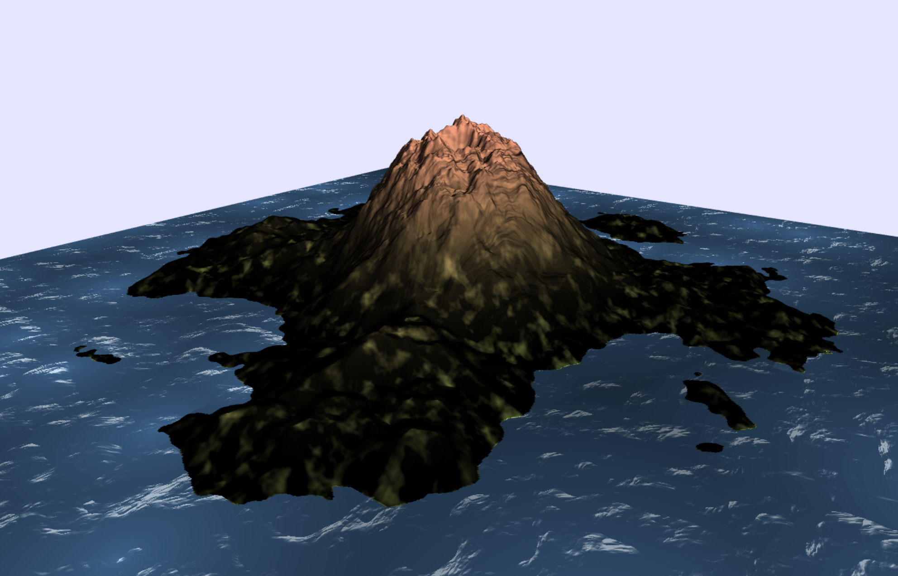
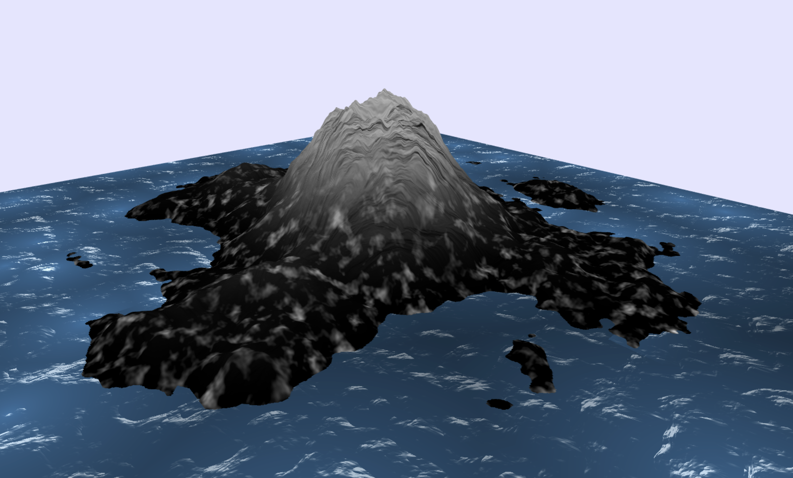
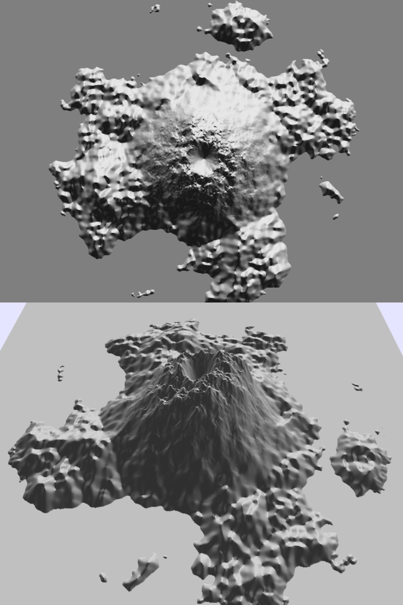

# Volcano

## Progress Summary

1. So far, we have started by creating a framework that will allow us to efficiently add features to our project. Then, we designed an algorithm using perlin noise to create the heightmap of a volcano on a island. And we have integrated a UI menu that allows to set the generation parameters in live (17 different parameters in total). \
In parallel, we have worked on generating a procedural texture for the volcano in order to get a more realistic look. \
We have also worked on the smoke particles coming out of the volcano crater. \
Finally, we have started working on the simulation of the lava flow following the process described in the paper [Animating lava flows](http://www-evasion.imag.fr/Publications/1999/SACNG99/gi99.pdf).

	<table>
		<caption>Achieved Goals</caption>
		<tr>
			<th></th>
			<th>Yoann Lafore</th>
			<th>Shimeng Ye</th>
			<th>Alberts Reisons</th>
		</tr>
		<tr>
			<td>Week 1</td>
			<td>Write the project proposal</td>
			<td>Find resources for textures needed to render terrain/rock/grass and etc</td>
			<td>Setup the repository for the project</td>
		</tr>
		<tr>
			<td>Week 2</td>
			<td>Adapt code from Perlin noise homework to have foundation framework for the project + Design the procedural generation of the volcano</td>
			<td>Try found textures on the terrain and adjust the parameters according to the visual effect</td>
			<td>Read ressources explaining how to add particles</td>
		</tr>
		<tr>
			<td>Week 3</td>
			<td>Start the implementation of the lava flow simulation</td>
			<td>Study the techniques for the generation of the textures and clean-up the code for the implementation. Add water texture and fine tune all textures</td>
			<td>Have a base implementation for adding billboards and particles to the scene</td>
		</tr>
	</table>

2. Show some preliminary results.

{width="300px"}

3. Optionally present the validation of any feature you have already implemented. This is not mandatory, but it can help you get useful feedback for the final report.

	- Feature Name

		- Implementation

			Briefly describe how you implemented the feature.

		- Validation

			Provide evidence (plots, screenshots, animations, etc.) that the feature works as expected.

  - Volcanic island terrain generation
    
    - Implementation

      The creation of the terrain has been splitted into two parts: the island and the volcano itself. \
      The island is first generated as a disk whose elevation smoothly decreases when approaching the edge in order to get a good transition with the water. Then, a combination of perlin FBM noises is used to get a more realistic terrain as well as little remote islands. \
      The volcano shape is created by generating a conic shape that descreases exponontially. Then, in the middle, we create a crater for where the lava particles will be emitted. Also, a combination of perlin FBM and turbulence noises are used to get the "rocky" look of the volcano. \
      Finally, both heightmaps are combined in order to get the look of a volcanic island.

      Also, to enhance interactivity, we have created a menu that allows to play with the various parameters of the generation. This allows to create all sort of volcanic islands by adjusting a total of 17 different parameters that play in the generation process.

    - Validation

      

  - Terrain texture generation

    - Implementation

		We implement two textures to represent the mountain rocks and the low-altitude grass-like texture. The grass-like texture is achieved by using Voronoi method (cellular noise) combined with perlin noise. The mountain-rock like texture is done by employing fractal brownian motion on a type of cell noise (by taking the weighted sum of noise in the neighboring noise cells of a certain kernel size). This texture is highlighted by evaluating the dot product of the derivative of the generated texture and a fixed-direction light source. The final texture is a blending of these two textures depending on the height of the terrain in order to achieve a visual transition of grass to rock like texture. \
    \
		The water texture is created by using the same base function of the mountain texture with different parameters and a twist on top of it. In order to make the sea wave realistic, the twist involves an adaptation on pure mountain texture function, which a third-order polynomial is used to intepolate the dark side of the water to the lighter wave, creating a sharper transition. In addition to that, a cellular noise is added on to the water to achieve sort of different depth of the water in different regions. \
    \
		Finally, normal mapping (false color converted to grey-scale) is added to make it more realistic.

    - Validation

		Mountain/Grass/Water Blending Texture: 

		 \

		Normal Mapping: 

		 

4. Report the number of hours each team member has dedicated to the project (as recorded on Moodle). Comment on the accuracy of your initial time estimates. Critically reflect on your work plan and assess if you are on track.

	<table>
		<caption>Worked Hours</caption>
		<tr>
			<th></th>
			<th>Yoann Lafore</th>
			<th>Shimeng Ye</th>
			<th>Alberts Reisons</th>
		</tr>
		<tr>
			<td>Week 1</td>
			<td>8</td>
			<td>5</td>
			<td>4</td>
		</tr>
		<tr>
			<td>Week 2</td>
			<td>10</td>
			<td>13</td>
			<td>2</td>
		</tr>
		<tr>
			<td>Week 3</td>
			<td>10</td>
			<td>14</td>
			<td>6</td>
		</tr>
	</table>

## Schedule Update

1. Acknowledge any delays or unexpected issues, and motivate proposed changes to the schedule, if needed.

	Alberts did not have a lot of time to spend on the project these last weeks so the particle effects are still not completed. He also found it hard to get started with creating a new actor from scratch and adding new meshes to the render, since this was already in large part provided in the labs. He will therefore spend another week to finish his work on particle effects.

	When digging further into the implementation of certain features we noticed a potential issue which is the following : \
  We initially planed to apply a voronoi tesselation of the lava particles system in order to generate the mesh. However, after looking at further documentations, we realised that this was going to be a hard task to implement properly. And this is amplified by the fact that we need to apply other constraints to the tessalation in order to keep a consistent mesh of the lava flowing.
  Moreover, the implementation of this feature is necessary before starting working on the rendering of the lava.
  So, we believe that continuing on the voronoi tesselation will introduce too much delay to finish the project correctly.
  We then propose the following alternative:\
  \
  Instead of using voronoi tesselation to create the lava mesh we will render each particle individually. \
  In order to keep some realism, some randomness will be introduced in the mesh generation of each lava particle. Regarding the rendering, it will still be physically based on the temperature of the particle combined with a procedural lava texture. \
  In order to compensate for the removing of the voronoi tesselation feature, we propose to implement the normal mapping feature (10 points) for the volcano and the water. This will allow to enhance the "rocky" look of the volcano as well as giving a more volumetric look to the water. \
  \
  To resume, we propose the following changes in the features:
  
  **Remove :**

  - Lava rendering (voronoï tesselation of particles flow, semi-physically based rendering)	(20 points)
   
  **Add :**

  - Lava rendering (individual particle, semi-physically based rendering) (10 points)
  - Normal mapping (for water and volcano) (10 points)

2. Present the work plan for the remaining time.

	<table>
		<caption>Updated Schedule</caption>
		<tr>
			<th></th>
			<th>Yoann Lafore</th>
			<th>Shimeng Ye</th>
			<th>Alberts Reisons</th>
		</tr>
		<tr>
			<td>Week 4</td>
			<td>Fluid simulation of the lava (2/2)</td>
			<td>Normal mapping of the volcano terrain and water</td>
			<td>Create specific effects for smoke and projections</td>
		</tr>
		<tr>
			<td>Week 5</td>
			<td>Add ways for the user to interact with the simulation</td>
			<td>Procedural/Temperature based rendering of a lava particle</td>
			<td>Create the procedural mesh of a lava particle</td>
		</tr>
		<tr>
			<td>Week 6</td>
			<td>Recording the final video</td>
			<td>Prepare the final presentation</td>
			<td>Write the final report</td>
		</tr>
	</table>