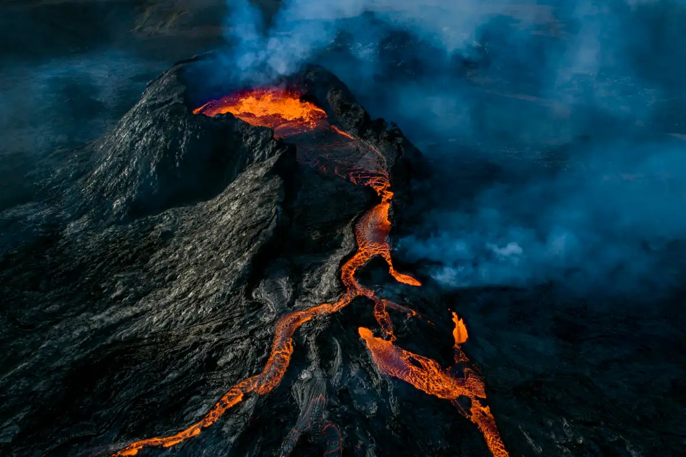

# Volcano Simulation

{width="300px"}

## Abstract
The final objective is to have a scene of a realistic volcano eruption rendered in real time.
The user will be able to play with the simulation parameters in order to get various volcano eruptions.

The scene will consist of the following:
<ul>
<li>A volcano terrain that is proceduraly generated (terrain + texture)</li>
<li>Particles effects to represent the smoke above the crater</li>
<li>A particle simulation of the lava flow that is exiting the crater</li>
<li>A convicing rendering of the lava flow using Voronoï tesselation and procedural textures that depend on physical aspects of the lava</li>
</ul>

#### Action plan

To achive this goal, we plan on doing the following:

We will generate the volcano terrain and texture procedurally using the techniques that we have worked on during the homework on Perlin noise.

Then, we will implement a particle system to generate the smoke that is leaving from the volcano crater.

We will create a simulation of the lava flowing from the volcano. To do so, we are going to perform a fluid simulation using a paricle system to represent the lava. In particular, we'll base our implementation mainly on the paper [Animating Lava Flows](http://www-evasion.imag.fr/Publications/1999/SACNG99/gi99.pdf) that describes an efficient approach to animate lava flows.

Then, we have to create a convicing rendering of the lava flow particle system. To do so, the first thing to do is to generate an appropriate mesh to represent the shape of the lava particles systems. This can be achieved using a method called Voronoï tesselation. To implement it, we'll use the approach proposed in [Voronoi cell analysis: The shapes of particle systems](https://pubs.aip.org/aapt/ajp/article/90/6/469/2820132/Voronoi-cell-analysis-The-shapes-of-particle).

Finally, we need to bring texture to our lava flow for it to be convicing. To do so, we'll use an approach that is partially based on physical aspects of the lava and also based on a procedural approach. Conretelly, the plan is to use the temperature a lava point to get it's "orangeness". Then, on top of that we add a procedural texture to get a good render with crusts.

To finish, we plan on making the flow simulation parameters changeable by the user. This way, we can observe various kind of eruptions. Then, we'll proceed on recording a video of an eruption rendered through this project to showcase during the final presentation.

#### Why this project ?

Volcanoes are among the most powerful and awe-inspiring phenomena on Earth. Using physics simulations and computer graphics, we aim to offer the ability to interact with and observe these formidable forces in real time.

#### New techniques brought to the WebGL framework

As discussed in the action plan above, this project will require to add various techniques to the WebGL framework. Concretely, we'll need to add : particle effects (smoke), fluid particles system simulation (lava flow), particles system voronoï tesselation and procedural generation of terrain and textures.

#### Technical challenges

The predominant challenge is the lava flow simulation which is the heart of the project. However, the paper [Animating Lava Flows](http://www-evasion.imag.fr/Publications/1999/SACNG99/gi99.pdf) is well detailled and should provide us with the necessary basis to implement the lava flow simulation.

Another challenge will also be to correctly render the lava flow particles system. But once again, we have found ressources that should be able to guide us through the implementation.

Finally, implementing smoke particles effect will be challenging but there are plenty of ressources on this matter specifically available online.

## Features

| Feature                | Points       | Adapted Points |
|------------------------|--------------|----------------|
| Procedural volcano terrain generation              | 5           | 5             |
| Procedural texture generation              | 10           | 10             |
| Lava flow fluid simulation              | 20           | 20             |
| Lava rendering (voronoï tesselation of particles flow, semi-physically based rendering)            | 20           | 20             |
| Particle Effects for smoke              | 20           | 15             |

## Schedule

<table>
	<tr>
		<th></th>
		<th>Yoann Lafore</th>
		<th>Shimeng Ye</th>
		<th>Alberts Reisons</th>
	</tr>
	<tr>
		<td>Week 1</td>
		<td>Write the project proposal</td>
		<td>Find the ressources that we'll need during the project</td>
		<td>Setup the git repository</td>
	</tr>
	<tr>
		<td>Week 2</td>
		<td>Procedural volcano terrain generation</td>
		<td>Procedural texture generation of the volcano terrain</td>
		<td>Smoke particule effects for the volcano (1/2)</td>
	</tr>
	<tr>
		<td>Week 3</td>
		<td>Fluid simulation of the lava (1/2)</td>
		<td>Physically-only based rendering of the lava flow</td>
		<td>Smoke particule effects for the volcano (2/2)</td>
	</tr>
	<tr>
		<td>Week 4</td>
		<td>Fluid simulation of the lava (2/2)</td>
		<td>Add procedural texture to the physically based lava texture</td>
		<td>Voronoï tesselation of the lava flow particles system</td>
	</tr>
	<tr>
		<td>Week 5</td>
		<td>Add ways for the user to interact with the simulation</td>
		<td>Prepare a cinematic scene for the video recording</td>
		<td>Start the writting of the final report</td>
	</tr>
	<tr>
		<td>Week 6</td>
		<td>Recording the final video</td>
		<td>Prepare the final presentation</td>
		<td>Finish the final report</td>
	</tr>
</table>

## Resources

### Lava Flow simulation
[Animating Lava Flows Paper](http://www-evasion.imag.fr/Publications/1999/SACNG99/gi99.pdf) \
[Animating Lava Flows Showcase website](http://www-evasion.imag.fr/Membres/Fabrice.Neyret/Lave/index-eng.html#Rendering) \
[Modeling and Visualization of Lava Flows](https://www.researchgate.net/publication/365591320_Modeling_and_Visualization_of_Lava_Flows) \
[Moving Mesh Methods for Computational Fluid Dynamics](https://home.cscamm.umd.edu/publications/hangzhou_CS-05-04.pdf)

### Terrain generation
[Volcanic Map Generation Step by Step](https://timetocode.tumblr.com/post/93970694121/volcanic-map-generation-step-by-step) \
[Making maps with noise functions](https://www.redblobgames.com/maps/terrain-from-noise/) \
[Using Perlin Noise to Create a Terrain Mesh](https://www.scratchapixel.com/lessons/procedural-generation-virtual-worlds/perlin-noise-part-2/perlin-noise-terrain-mesh.html)

### Lava rendering
#### Creating the lava mesh with voronoï tesselation
[Voronoi cell analysis: The shapes of particle systems](https://pubs.aip.org/aapt/ajp/article/90/6/469/2820132/Voronoi-cell-analysis-The-shapes-of-particle) \
[Particle hydrodynamics with tessellation techniques](https://academic.oup.com/mnras/article/406/4/2289/1018040) \
[Tessellation Methods for Modeling the Material Structure](https://www.researchgate.net/publication/272174585_Tessellation_Methods_for_Modeling_the_Material_Structure)

#### Rendering the lava
[Animating Lava Flows Paper](http://www-evasion.imag.fr/Publications/1999/SACNG99/gi99.pdf) (end of the paper) \
[Texture distortion for lava](https://www.shadertoy.com/view/msycDz) \
[Physically based rendering in OpenGL](https://learnopengl.com/PBR/Theory) \
[Lava shader demo](https://threejs.org/examples/webgl_shader_lava.html)

### Particles
[Visual Simulation of Smoke](https://web.stanford.edu/class/cs237d/smoke.pdf) \
[OpenGL-tutorial - Particles / Instancing](https://www.opengl-tutorial.org/intermediate-tutorials/billboards-particles/particles-instancing/) \
[Learn OpenGL - Particles](https://learnopengl.com/In-Practice/2D-Game/Particles)

### Procedural textures
[Perlin noise](https://en.wikipedia.org/wiki/Perlin_noise#:~:text=Perlin%20noise%20is%20a%20procedural,details%20are%20the%20same%20size.) \
[Rock texture example](https://www.shadertoy.com/view/td2GWt) \
[Cellular Noise](https://thebookofshaders.com/12/)